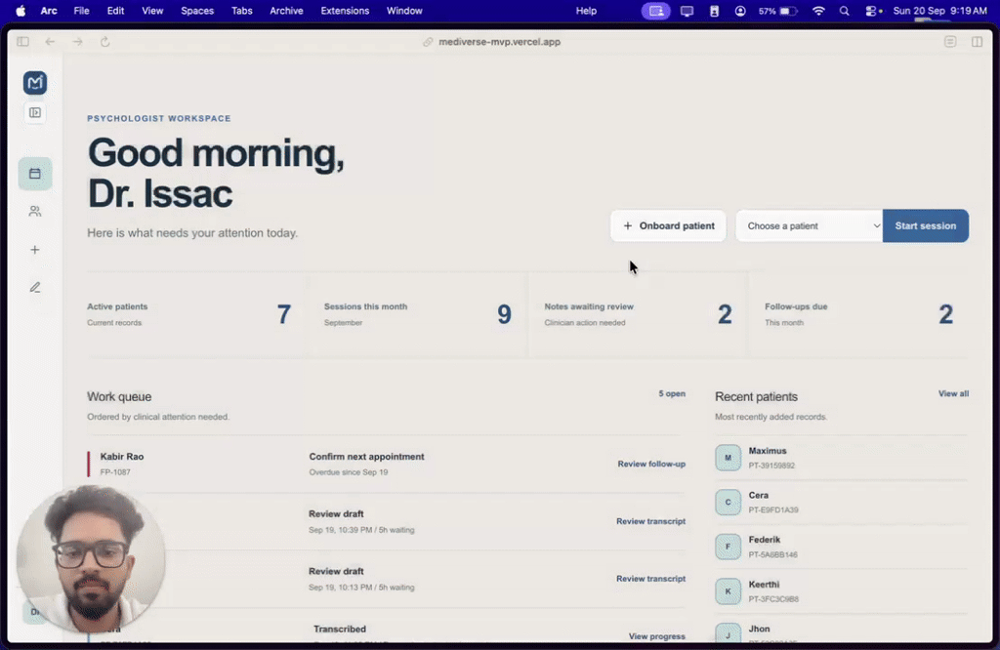
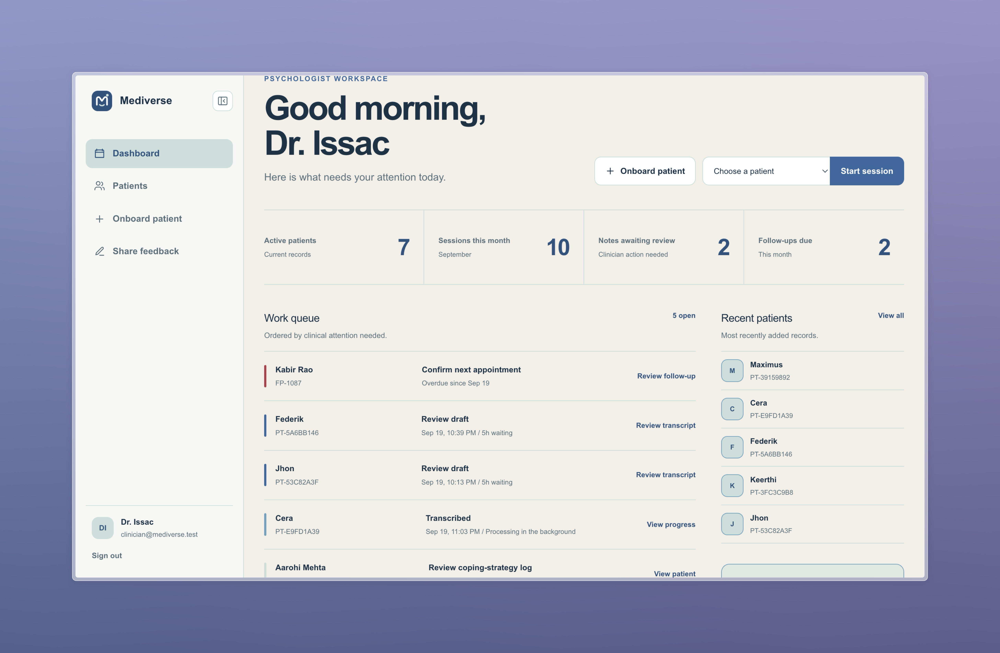
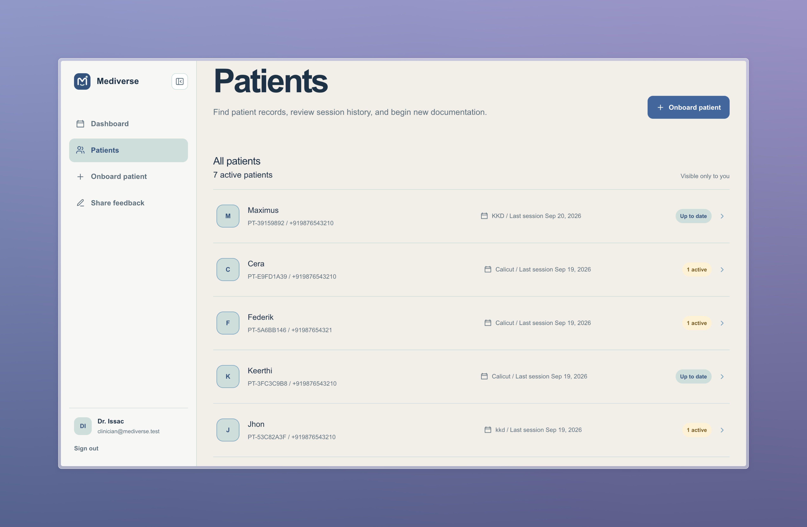
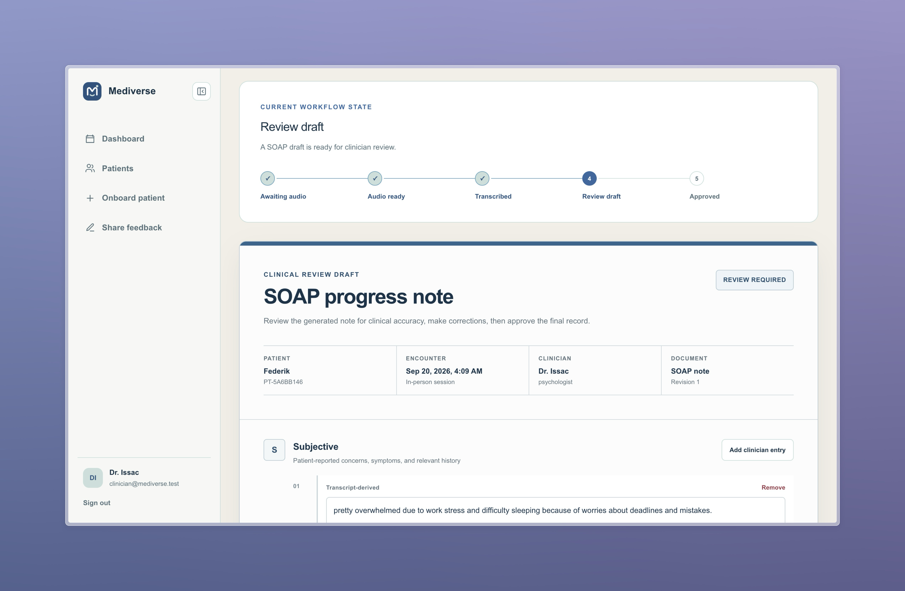

# Mediverse

**Repository:** [github.com/rishi9808/mediverse](https://github.com/rishi9808/mediverse)

## Demo Video

[](https://www.loom.com/share/870435c091de423b95413af311934336)

**[Play the full demo on Loom](https://www.loom.com/share/870435c091de423b95413af311934336)**

## Overview

A consultation ends, but the clinician's work continues: documenting what was discussed, updating the patient record, and keeping track of what comes next. Mediverse starts with that moment.

Mediverse turns consented session audio into a draft progress note that a psychologist can check against the conversation, edit, and approve. The aim is to give clinicians more room to focus on the person in front of them while making the work around each consultation easier to manage.

I built Mediverse as a solo hackathon project and the first step toward a potential product. The next step is to speak with doctors and psychologists, understand how their practices actually operate, and improve Mediverse around the problems they find most valuable to solve. The longer-term ambition is an **AI-backed clinical operating system** connecting patient onboarding, appointment booking through AI calls, consultation documentation, and follow-up in one workspace.

Today's prototype demonstrates the documentation workflow using fictional patients and English, in-person sessions. The broader clinical OS is the product direction I intend to develop with clinician input.

## Problem Statement

The conversation is only one part of a patient's care journey. Around it sit intake details, appointments, progress notes, and follow-ups. My starting product hypothesis is that reducing the effort of keeping these pieces connected can make everyday clinical work easier.

I chose documentation as the first problem to explore. A useful note needs to preserve the meaning of a conversation in a form the clinician can return to later. An AI summary only helps if the clinician can quickly check its sources, correct it, and trust the review process.

Mediverse asks a practical question: **can a clinician finish a useful, accurate note with less effort by reviewing an evidence-linked draft?** The prototype makes that question testable. Conversations and workflow reviews with doctors and psychologists will help establish where it delivers value and what should come next.

## Solution

Imagine a psychologist finishing a session and opening a draft with the key points already organized. Each generated statement links back to the relevant transcript segment. The psychologist can inspect the context, correct the wording, add observations, and decide when the note is ready.

That is the first Mediverse workflow:

**Patient record → consent → audio → transcript → SOAP draft → clinician review → approval → patient history and PDF.**

SOAP organizes the note into **Subjective, Objective, Assessment, and Plan**. Observations entered by the clinician are distinguished from transcript-derived content. Approval preserves a fixed snapshot of the final note, giving the clinician a record they can reopen before the next visit.

The product principle is simple: AI prepares the draft; the clinician owns the final record. As Mediverse grows, that same emphasis on visibility and control will guide how I approach other parts of the practice.

## Features

- **Start with the patient:** onboard patients and keep their session history and follow-ups together in a clinician workspace.
- **Capture a consented conversation:** record an in-person session or upload existing audio, with limits of 90 minutes and 50 MiB.
- **See who said what:** review a speaker-labelled transcript with automatic psychologist/patient identification.
- **Review a draft with its evidence:** inspect SOAP statements alongside their transcript references and add clinician observations separately.
- **Keep control of the final note:** edit the draft, track revisions, and explicitly approve an immutable final version.
- **Take the record forward:** reopen notes in the patient history or download an approved PDF without the full transcript by default.
- **Manage the audio lifecycle:** a configurable scheduled worker deletes due audio while preserving the transcript and note evidence.
- **Help shape the product:** capture structured psychologist feedback and use repeatable fictional cases to explore the workflow.

## Tech Stack

- **Frontend:** Next.js 16 App Router, React 19, TypeScript, Tailwind CSS 4, and custom CSS.
- **Backend:** Next.js Server Actions and Route Handlers, with PostgreSQL functions for workflow rules.
- **Database:** Supabase PostgreSQL with row-level security and versioned SQL migrations.
- **APIs / Services:** Supabase Auth and private Storage; Deepgram Nova-3; OpenAI for structured SOAP drafting and speaker identification, plus an alternative transcription path.
- **Hosting / Deployment:** Vercel configuration, including a daily audio-retention cron compatible with the Hobby plan; Supabase for hosted backend services. The live demo is deployed at [mediverse-mvp.vercel.app](https://mediverse-mvp.vercel.app/).
- **Other Tools:** pnpm, Supabase CLI, PGlite, Node.js test runner, ESLint, pdf-lib, and tus-js-client for resumable uploads.

## Codex / OpenAI Usage

OpenAI is part of the application's core drafting workflow. The complete transcript is supplied to a model to identify speaker roles and produce a SOAP draft using Structured Outputs. The default text model is `gpt-4o-mini-2024-07-18`, configurable through `OPENAI_CLINICAL_MODEL`. Application and database validation check output structure and transcript references before saving the draft.

Deepgram Nova-3 handles transcription when configured. OpenAI `gpt-4o-transcribe-diarize` provides the alternative when the Deepgram key is absent, or when `TRANSCRIPTION_PROVIDER=openai` is selected.

Codex assisted with inspecting the implementation and preparing this project documentation, including checking features, dependencies, and local setup requirements against the repository.

AI helps turn conversation content into an organized first draft. The psychologist remains responsible for reviewing, correcting, and approving the note; valid references alone do not establish clinical accuracy.

## Demo

### Live Demo

[Open the Mediverse demo](https://mediverse-mvp.vercel.app/). Hackathon reviewers can select **Skip login — enter reviewer demo** for one-click access to the fictional clinician workspace.

Manual fallback credentials: `clinician@mediverse.test` / `med@123`.

## Screenshots

### Clinician dashboard



### Patient records



### SOAP note review



## How to Run Locally

Prerequisites: Node.js compatible with the pinned Next.js and pnpm versions, pnpm 11.0.6, Docker for local Supabase, and API keys for live AI processing.

```bash
git clone https://github.com/rishi9808/mediverse.git
cd mediverse
pnpm install --frozen-lockfile
pnpm db:start
pnpm db:reset
```

`pnpm db:reset` rebuilds the **local** database and loads fictional fixtures.

Create `.env.local` in the repository root with your own values:

```dotenv
NEXT_PUBLIC_SUPABASE_URL=<local Supabase API URL>
NEXT_PUBLIC_SUPABASE_PUBLISHABLE_KEY=<local Supabase publishable key>
OPENAI_API_KEY=<your OpenAI API key>
DEEPGRAM_API_KEY=<your Deepgram API key>
```

Use the local URL and public key reported by Supabase. Keep OpenAI and Deepgram keys server-only, without a `NEXT_PUBLIC_` prefix. Deepgram is optional if you use OpenAI transcription; OpenAI is still required for live SOAP generation.

In local Supabase Studio, create a confirmed email/password test user. The app creates its clinician profile on first authenticated access. The seeded `psychologist@mediverse.example` record has no password and is not a ready-to-use login. A newly created user has a separate workspace; use the fictional workspace restoration control on the Feedback page to populate it.

```bash
pnpm dev
```

Open [http://localhost:3000](http://localhost:3000) and sign in with the test account.

For production audio retention, also configure server-only `SUPABASE_SECRET_KEY` and `CRON_SECRET`. The Vercel schedule in `vercel.json` calls `/api/cron/audio-retention` daily at midnight UTC (`0 0 * * *`) with bearer authentication. On the Hobby plan, invocation can occur anywhere within the scheduled hour. Due audio is deleted on the next successful run after its retention deadline, so daily scheduling adds roughly a day of possible cleanup delay. Running the development server alone does not schedule deletion jobs.

### Checks and maintenance

```bash
pnpm test                 # Database, clinical pipeline, transcription, PDF, and retention tests
pnpm db:test              # PostgreSQL behavior through PGlite; no Docker or secrets required
pnpm lint
pnpm exec tsc --noEmit
pnpm build
pnpm db:types             # Regenerate types from a running local Supabase instance
```

For a manual demo check, sign in, open a fictional patient, capture consent, upload short fictional audio, review speaker attribution and SOAP evidence, approve the note, and inspect its downloaded PDF and patient-history entry.

## Additional Notes

### From a hackathon build to a product

Mediverse is intended to continue beyond this hackathon. The immediate priority is to speak with doctors and psychologists, walk through their current workflows, and put the prototype in front of them using fictional cases. I want to learn where documentation takes the most effort, what makes a draft useful, and what would make them comfortable adopting a tool like this.

Those conversations will guide the next iterations. I plan to evaluate the time needed to review and approve a note, the amount of correction required, missed or unsupported information, and whether clinicians would want to use the workflow again. These are questions to investigate; time savings and clinical usefulness have not yet been established.

### The next phase: an AI-backed clinical OS

The longer-term vision is to support the journey from a patient's first contact with a practice through ongoing care:

- **Patient onboarding:** bring intake, patient details, and consent into a connected workflow.
- **Appointment booking through AI calls:** help patients reserve, confirm, or reschedule appointments, with a path to human assistance.
- **Consultation documentation:** build on the current transcript-to-note workflow and adapt it to the needs of different clinicians.
- **Continuity between visits:** connect patient history, follow-ups, and practice workflows so clinicians can see what needs attention next.

The next phase will work toward this broader clinical OS in stages. Clinician feedback will determine the sequence and scope; AI calling and appointment booking are planned capabilities, not features of the current build.

### Security and trust as product requirements

Patient data security is central to the product I want to build. The prototype already includes clinician-scoped database access, private audio storage, server-only AI credentials, and an audio-deletion workflow. Moving toward real-patient use will require a wider assessment of data handling, access controls, consent, retention, service providers, and operational practices.

My ambition includes working toward **HIPAA compliance where applicable**, alongside the privacy and healthcare requirements of the markets I serve. Mediverse does **not currently claim HIPAA compliance**. Security and compliance readiness will be part of planning and validating a real-patient pilot as the product develops.

### Current prototype boundaries

- The demo uses fictional data. Clinical accuracy and readiness for real-patient use have not been established.
- The current workflow focuses on English, in-person sessions with two-speaker review. Guardian consent, multilingual support, amendments after approval, and EMR integration remain outside the current build.
- The 90-minute limit and boundary fixtures do not establish live transcription reliability or note quality for full-length recordings.
- Transcript references help clinicians review generated statements; they do not guarantee that a statement accurately reflects its source.
- Audio deletion uses a 24-hour prototype grace period after approval and requires a configured worker. Real-patient retention requirements remain to be evaluated.

Further implementation details:

- [Database design, permissions, and workflow contract](docs/database-design.md)
- [Database migrations](supabase/migrations)
- [Fictional local seed](supabase/seed.sql)
- [Generated database types](lib/database.types.ts)
- [SOAP content types](lib/soap.ts)
- [Original product discovery and scope report](docs/project-report.md) — planning context; some implementation descriptions predate the current build.
