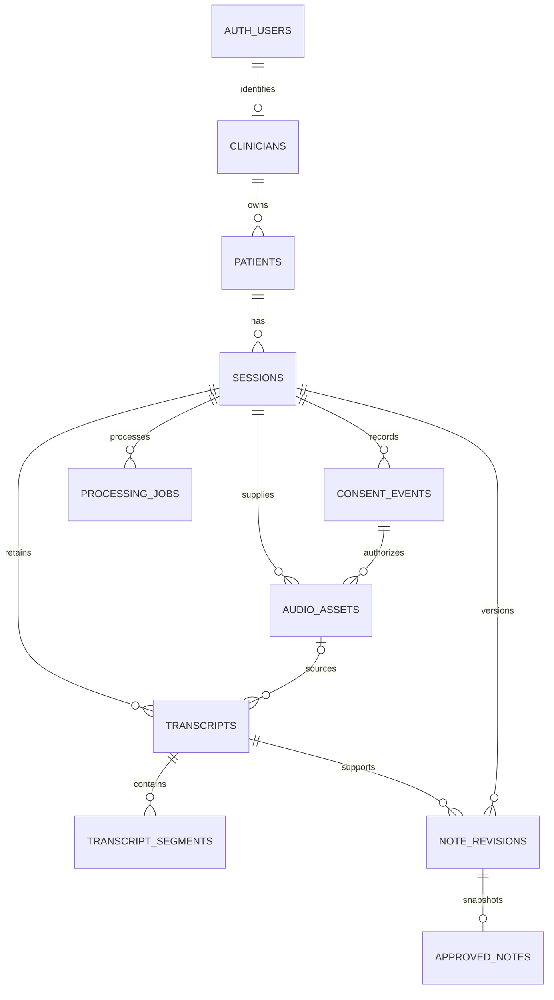

# Mediverse database

This implements the Mediverse clinician workspace and documentation foundation. It uses Supabase Postgres 17, Supabase Auth identities, row-level security (RLS), and private Storage. Run commands in this nested `mediverse/` Git repository, not the outer starter. The discovery report describes the earlier demo scope; the current patient table supports real clinical onboarding.

Hosted target: **Mediverse**, project `fhkujbwabvsuykjkczbk`. SQL migrations are the source of truth. `lib/database.types.ts` is generated from the hosted public schema; `lib/soap.ts` defines the SOAP JSON contract.

## Relationships



| Table | Purpose |
| --- | --- |
| `clinicians` | One profile per Auth user; initial profession is psychologist. |
| `patients` | Clinician-owned patient identity, mobile, optional email, location, optional demographics, and archive timestamp. |
| `sessions` | Encounter, patient, clinician, occurrence time, English language, in-person setting, recording/upload origin, and client request ID. |
| `consent_events` | Append-only grants/revocations of versioned consent covering capture/upload, transcription, and AI drafting. Latest event governs processing. |
| `audio_assets` | Private object locator, consent reference, verified media metadata, and deletion lifecycle. No audio bytes in Postgres. |
| `transcripts` | Versioned provider/model metadata, source kind, duration, and ingestion readiness. Seeded fallback needs no audio. |
| `transcript_segments` | Ordered timestamped speech, stable evidence IDs, diarization key, and confirmed speaker role. |
| `note_revisions` | Immutable SOAP save history, transcript version, and optional model/prompt version. |
| `approved_notes` | One immutable approved snapshot per session with identity and approval metadata. |
| `processing_jobs` | Work ledger with unique request keys, attempts, availability, lease expiry, and sanitized error codes. |
| `private.retention_settings` | Administrative audio grace period; **24 hours** is a reversible prototype default. |

UUIDs identify domain records. Dates use `timestamptz`; offsets and durations use integer milliseconds. Composite foreign keys carry `clinician_id` through relationships, preventing cross-account references even for workers that bypass RLS. No clinical-history relationships use cascading deletes. Local reset data is synthetic and must remain separate from real patient records.

## Access model

The prototype uses individual clinician ownership. Teams, delegates, patient portals, and cross-clinician sharing are outside scope.

- `anon` has no application-table or workflow-RPC access.
- `authenticated` reads owned rows. It can create its clinician profile, create/edit owned patient contact details, create sessions, and confirm speaker roles before evidence is cited. Column grants prevent changing ownership, timestamps, verified media metadata, or approval data directly.
- Consent, audio registration, saves, and approval use authenticated RPCs. Public wrappers are security invokers. Narrowly granted implementations live in the unexposed `private` schema, check `auth.uid()`, and lock the owned session.
- `service_role` ingests transcripts/segments, verifies audio metadata, and updates jobs. It cannot insert approved notes or revisions directly. Saving a generated draft uses a clinician-scoped authenticated client. Only an explicit authenticated clinician request approves it.
- `patient_timeline` uses `security_invoker = true` and preserves RLS. Its documentation status is derived from saved records; worker progress/failures come from `processing_jobs` separately.

Keep `private` out of the exposed API schemas and worker credentials on the server. Do not authorize using editable user metadata. Database owners can change SQL objects; these controls protect application access, not against the database administrator.

## Workflow contract

1. Authenticate with Supabase Auth; insert a `clinicians` profile whose `id` is the user's ID. Create an owned patient profile and session. Reuse `client_request_id` on session retries; on unique conflict, retrieve the existing session.
2. Present versioned consent and call `record_consent(session_id, 'granted', policy_version)` before capture/upload. Identical retries return the latest existing event. Revocation appends an event, blocks future processing and authenticated audio access, and schedules remaining audio for immediate removal. The database records the clinician's attestation; the UI must collect it.
3. Call `register_audio(session_id, mime_type)`, which returns the same active asset for matching retries. Upload to its `bucket_id` and `object_path` with `upsert: false`. Paths are `clinician UUID/session UUID/asset UUID`, without patient names. On upload conflict, verify the existing object through the worker instead of replacing it.
4. A trusted worker inspects the actual media and sets `duration_ms`, `byte_size`, and `state = 'verified'` together. Limits are **90 minutes** and **50 MiB**; long sessions need compressed audio. MIME types are listed in the storage migration. SQL validates metadata, not the media stream; do not trust browser-supplied measurements.
5. Insert a `pending` transcript, insert segments, then mark it `ready`. Audio-backed transcripts require verified audio from that session. Seeded fictional transcripts use `source = 'seeded'` and no audio ID. Segment timestamps must fit the transcript. The clinician confirms/corrects speaker roles before drafting.
6. Send the full transcript to the drafting provider. Save validated output using `save_note_revision`, with the last seen version (`0` for the first save). SQLSTATE `40001` means the screen is stale: reload before retrying. Every save increments the version. Referenced transcript text and roles freeze; corrections require a new transcript version and draft revision.
7. Explicit approval calls `approve_note(session_id, latest_revision_id, confirmed)`. The transaction requires `confirmed = true`, then checks ownership, consent, the exact latest save, complete SOAP, and media readiness. It snapshots the note with the confirmation event and schedules verified audio deletion. Retrying the same approval returns the existing snapshot. Further drafts/evidence on that approved session are rejected; amendments are a later workflow.
8. PDF rendering reads `approved_notes.snapshot`, including patient/psychologist identity, session metadata, approval time, SOAP, and evidence references. It excludes contact details, the full transcript, and storage paths. Evidence remains separately readable by the owner.

### SOAP JSON

All four keys are mandatory. Drafts allow empty arrays; approval needs an entry in each. The clinician must review and supply appropriate content rather than invent observations to fill a section.

```json
{
  "subjective": [{ "text": "Reports tension before work.", "origin": "transcript", "segment_ids": ["<segment UUID>"] }],
  "objective": [{ "text": "Observation entered by the psychologist.", "origin": "clinician", "segment_ids": [] }],
  "assessment": [],
  "plan": []
}
```

Transcript-derived statements require valid segment IDs from the selected transcript. Clinician entries use empty citation arrays. SQL rejects unknown keys, wrong types, empty text, invalid origins, and unrelated segment IDs. It verifies structure and provenance links, not clinical truth; review remains necessary.

SOAP uses JSONB because it is an ordered versioned document. Evidence remains relational. Only the validated RPC can insert revisions, so clients cannot bypass JSON/citation checks through table inserts.

### Retention and workers

Approval schedules deletion; it does not erase bytes. A future scheduled worker must query assets where `state = 'pending_deletion' and deletion_due_at <= now()`, remove objects through the **Storage API**, then set `state = 'deleted', deleted_at = now()`. A missing object can be an idempotent success after checking the exact path. Keep the metadata row for transcript FKs. Deleting `storage.objects` via SQL does not remove blob bytes.

The deletion worker, scheduler, provider calls, PDF renderer, Auth UI, and data screens are **not implemented by this database task**. SQL tests do not establish actual upload or blob deletion. Signed URLs issued before revocation may remain valid until expiry; use short lifetimes. Workers bypass Storage RLS and must recheck consent before provider calls. Revocation cannot undo data already sent to a provider.

Claim jobs transactionally with `FOR UPDATE SKIP LOCKED`, a bounded lease, and incremented attempts. Retry with the same `(session_id, kind, request_key)` and reclaim expired leases. The schema supplies the ledger and guards; execution is separate. Store safe error codes, not clinical text or raw provider errors.

## Local setup and verification

```bash
pnpm install --frozen-lockfile
pnpm db:test
pnpm lint
pnpm exec tsc --noEmit
```

`db:test` runs actual PostgreSQL using PGlite with a test-only Supabase Auth/Storage scaffold. All application migrations run unmodified. Tests cover ownership/grants, private storage policies, consent, media limits, speaker confirmation, citations, immutable revisions, stale saves/approvals, retries, evidence retention, and repeatable seeds.

With Docker running:

```bash
pnpm db:start
pnpm db:reset
pnpm db:types
```

`db:reset` explicitly erases **local** data. The seed creates `psychologist@mediverse.example`, one fictional patient, one approved session, and one draft. It contains no password, recording, or provider call. It is a database fixture, not a ready-to-use login account; provision a real local Auth login and equivalent owned fixtures for UI development. Re-running the seed preserves existing fixture sessions.

The foundation migrations were applied to the existing hosted Mediverse project. The patient-contact migration must be applied before the updated onboarding UI is deployed. The earlier behavior suite passed against hosted in a rolled-back transaction; no seed accounts, patients, or objects were retained. Apply future changes through new migrations rather than editing applied files.

Verified on 19 September 2026: 65 local tests (including patient contact validation, migration, and seed checks), ESLint, TypeScript, and the production application build passed. The earlier hosted suite had 55 SQL behavior checks and no security-advisor findings; those hosted results predate the patient-contact migration. The performance advisor reported only [unused-index informational notices](https://supabase.com/docs/guides/database/database-linter?lint=0005_unused_index). Full local Supabase/Docker and application HTTP/Storage flows were not exercised.

References: [RLS](https://supabase.com/docs/guides/database/postgres/row-level-security), [database functions](https://supabase.com/docs/guides/database/functions), [Storage policies](https://supabase.com/docs/guides/storage/security/access-control), and [explicit Data API grants](https://supabase.com/changelog/45329-breaking-change-tables-not-exposed-to-data-and-graphql-api-automatically).
